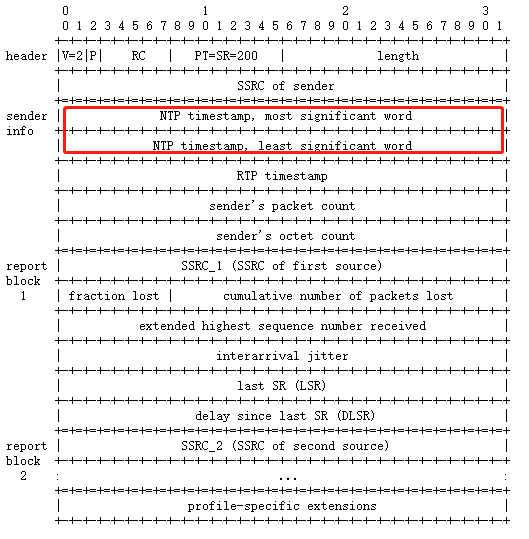

# Webrtc rtt计算

## 需求

webrtc中计算rtt主要是两个方面

1. 传输延时统计，音视频延时统计见《Webrtc 延时分析》
2. 用于带宽估算，具体原理见 《Webrtc 带宽控制》

## 原理

rtt计算的原理很简单，如下图1 所示

其中 <mark style="color:red;">A</mark>，<mark style="color:green;">B</mark> 为通讯双方， <mark style="color:red;">A</mark> 想要探测rtt，在 $$T_{1}$$时间发送探测请求， <mark style="color:green;">B</mark> 在$$T_{2}$$到请求并立即回复， <mark style="color:red;">A</mark> 在$$T_{3}$$收到回复，显然

$$
rtt = T_{3} - T{1}
$$

在rtt的基础上计算传输延时就是

$$
T_{延时}=\cfrac{ rtt}{2}
$$

​有人可能会疑惑，传输延时不应该是 $$T_{2} -T_{1}$$ 吗？确实，上述计算的延时是一个估算结果，但是$$T_{2} -T_{1}$$也是不对的，原因是 <mark style="color:red;">A</mark> 和 <mark style="color:green;">B</mark> 作为通讯双方他们的时间轴是不同步的（尽管有时间同步协议，但是很难做到毫秒级别的同步），$$T_{2} -T_{1}$$ 误差太大，在低延时场景中没有意义。

需要注意的是，能获取rtt值的只有 <mark style="color:red;">A</mark> , 即主动探测方。 如果 <mark style="color:green;">B</mark> 想要获取rtt值，可以采取以下两种方法

1. A 在探测出rtt后，通知给B
2. B 主动探测

## 实现

### 原理变种

不同于 [#yuan-li](./#yuan-li "mention") ，webrtc中rtt的探测回复并不会即时发送，而是会有一定的延时，如下图

显然

$$
rtt=T_{2}-T{1} -Delay
$$

为什么webrtc的回复不一定立即发生？因为webrtc需要控制带宽消耗，探测请求和回复都是由时间或者特殊事件触发，防止过多的包占据媒体数据传输所需要的带宽。

### 协议

在上述原理中，$$T_{2}$$是在接收到时生成的，因此协议中需要携带的是$$T_{1}$$​和Delay。而根据请求和回复的协议类型可以分成两种情况。

#### SR 和 RR

请求报文是 SR (sender report) ，需要携带 $$T_{1}$$ 对应的是报文中的 NTP timestamp。

回复报文是 RR（receiver report)， 需要携带 $$T_{1}$$​和Delay，分别对应报文中的 LSR （last SR) 和 DLSR (delay since last SR)字段。

.png>)

值得注意有两点

1. 是 LSR 和 DLSR 都是 32 位 的字段 ，而NTP timestamp是 64位的值，其实 LSR 和 DLSR 取的是 NTP timestamp 的中间32位。
2. 可以看到 SR 和 RR 其实都可以带 LSR 和 DLSR 但是只有 SR 能带 NTP timestamp，这就导致不能发送SR的参与者无法直接获取rtt值（可以让对方获取后，通知过来）。

#### XR 和 XR

为了解决接收方无法发送SR中的timestamp，XR中存在这样两种 report block 分别 替代 SR 和 RR中的字段。其中 **Receiver Reference Time Report Block** 用于代替 SR 中的 NTP timestamp。

.png>)

**DLRR Report Block **中 LRR 和 DLRR（RR 可以理解成** Receiver Reference Time Report Block**） 用于代替 RR (receiver report) 中的 LSR 和 DLSR。

.png>)

